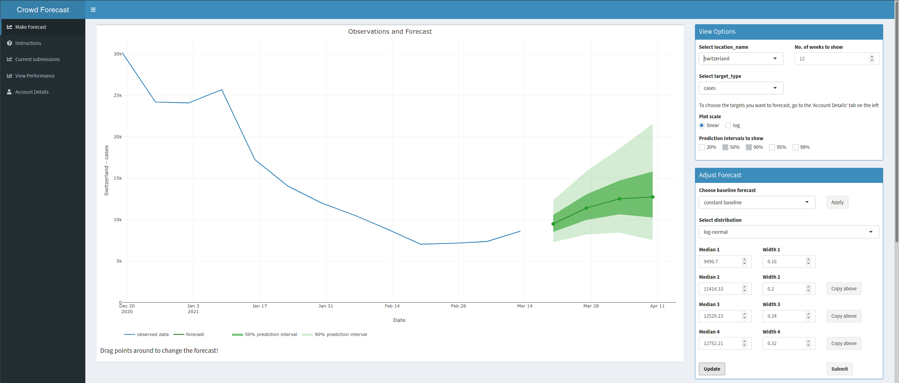

 

  

Crowdforecastr is a research project created by the [Epiforecasts](epiforecasts.io) group at the London School of Hygiene & Tropical Medicine. 

Via a [web-app](https://cmmid-lshtm.shinyapps.io/crowd-forecast/) forecasters can submit weekly predictions for Covid-19 case and death numbers. 

Currently we are collecting forecasts for 32 European countries and submit them to the [European Forecast Hub](https://covid19forecasthub.eu/) every week. Since October 2020 we have been submitting forecasts for Germany and Poland to the [German and Polish Forecast Hub](https://kitmetricslab.github.io/forecasthub/forecast). These models are then directly compared against computer models, making this a unique effort to compare humans against computer algorithms. 

The crowdforecastr app is written in R shiny and can easily be adapted to new projects. Please get in touch if you would like to set up a similar app. 

From here you can 
- learn more about how to [become a (better) forecaster](forecasting)
- go directly to the [crowdforecastr app](https://cmmid-lshtm.shinyapps.io/crowd-forecast/)
- look at our [evaluation of European Forecasts](https://epiforecasts.io/europe-covid-forecast) 
- look at our [evaluation of past German and Polish Forecasts](https://epiforecasts.io/covid.german.forecasts/)
- see the app source [code on github](https://github.com/epiforecasts/crowdforecastr)

